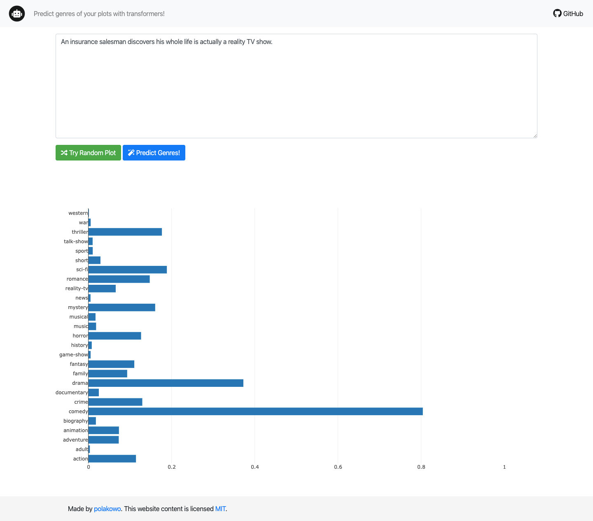

#### Usage

- Mount Google Drive on your computer
- Create `Colab Notebooks` directory and clone the textai repo there

In Google Colab,
- Run the [Data Preparation notebook](https://nbviewer.jupyter.org/github/polakowo/textai/blob/master/MoviePlots/DataPreparation.ipynb)
- Run the [Training notebook](https://nbviewer.jupyter.org/github/polakowo/textai/blob/master/MoviePlots/genre_prediction/RoBERTa/Training.ipynb)

Then locally,
- Copy the generated `output` directory to the `app/app` directory (you can delete `models` subdir)
- Run the following commands in terminal
```
docker build -t genre-prediction .
docker run -p 5000:5000 genre-prediction
open http://localhost:5000
```


