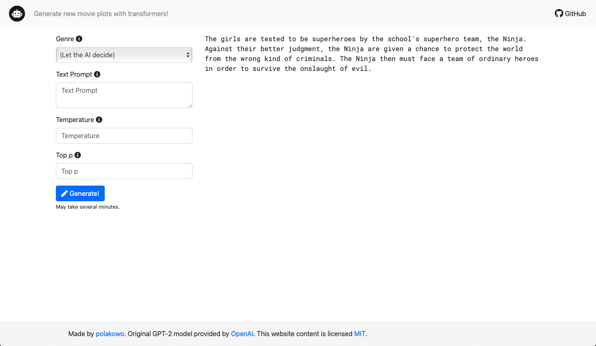

#### App deployment

- Mount Google Drive on your computer
- Create `Colab Notebooks` directory
- Run the following commands in terminal
```
cd "~/Google Drive/Colab Notebooks"
git clone https://github.com/polakowo/transformers.git
```
- Run the [DataPrep notebook](https://nbviewer.jupyter.org/github/polakowo/transformers/blob/master/MoviePlots/DataPrep.ipynb) in Google Colab
- Choose a model and run the [Training notebook](https://nbviewer.jupyter.org/github/polakowo/transformers/blob/master/MoviePlots/text_generation/without-titles/DistilGPT-2/Training.ipynb) in Google Colab
- Copy the generated `output` directory to the `app/app` directory
- Run the following commands in terminal
```
docker build -t text-generation .
docker run -p 5000:5000 text-generation
open http://localhost:5000
```

